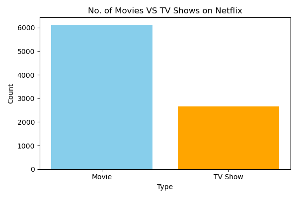
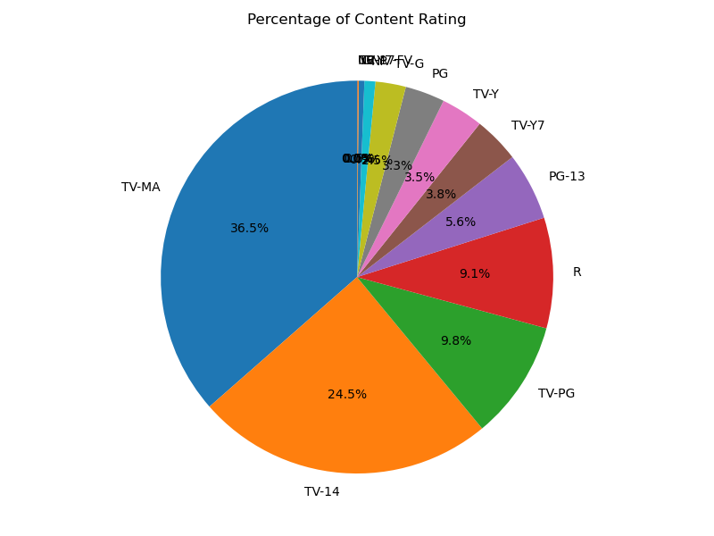
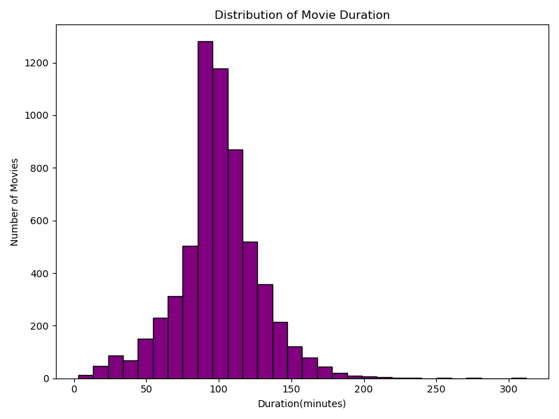
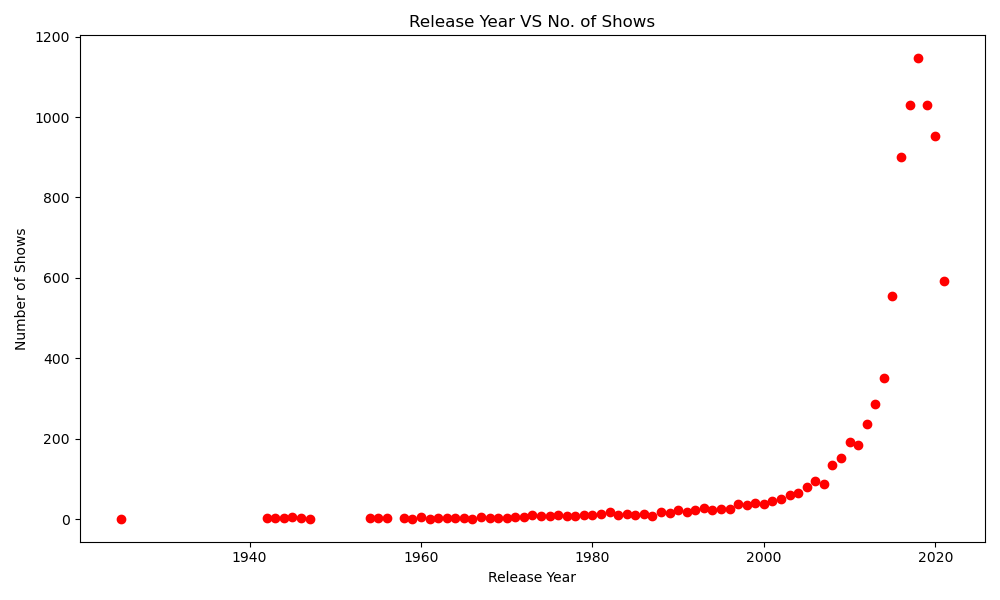
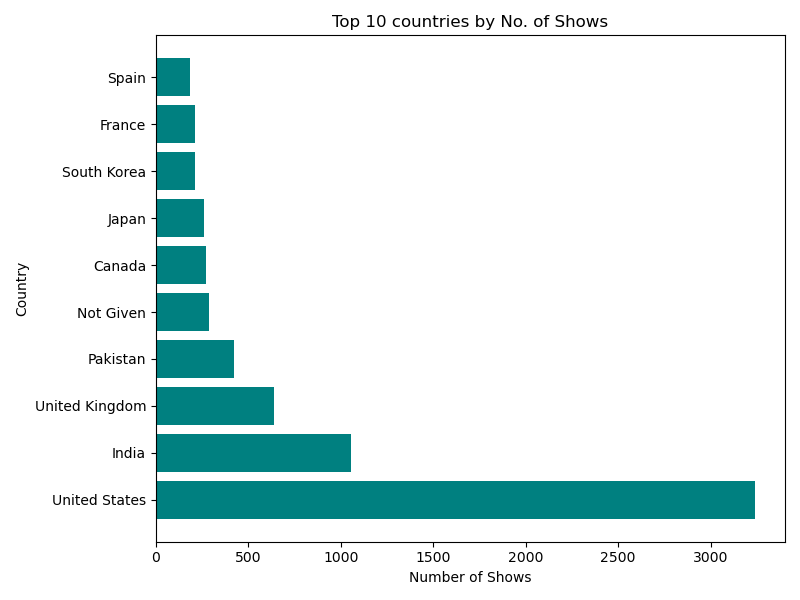
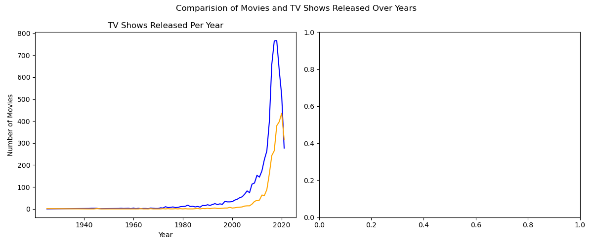

Netflix Data Analysis Project

📌 Project Overview
This project focuses on exploring and analyzing the Netflix dataset to uncover deep insights into movies and TV shows available on the platform. The objective is to understand content distribution, viewer preferences, genre popularity, and release trends over the years. This analysis helps in understanding how Netflix manages and expands its content library.

🛠️ Tech Stack & Tools Used
* Python: Core programming language used for analysis.
* Pandas: Extensively used for data cleaning, handling missing values, and data manipulation.
* NumPy: Used for performing efficient numerical operations and handling arrays.
* Matplotlib & Seaborn: Used to create clean, interactive, and informative data visualizations (charts and graphs).
* Jupyter Notebook: The interactive environment where the entire analysis was developed.
  
📊 Key Features & Visualizations Explained
The project includes several charts to visually represent the data findings:
* Content Type Distribution (Bar/Pie Chart): Compares the total number of Movies vs. TV Shows on Netflix to see what dominates the platform.
* Top Genres: Visualizes the most popular genres to understand what type of content Netflix produces the most.
* Release Trend Over Years (Line Graph): Shows the growth of content added to Netflix over the decades, highlighting the streaming boom.
* Country-wise Content Production: Displays which countries are the top contributors to Netflix's library.

💡 Key Insights & Conclusion
* Movies vs. TV Shows: A significant portion of Netflix's catalog consists of movies, though TV shows have seen rapid growth in recent years.
* Growth Spurt: There is a massive spike in content addition after 2015, showing Netflix's aggressive expansion strategy.
* Target Audience: Most of the content is tailored for mature audiences or teens, as shown by the rating distribution analysis.

🖼️ Images of charts

1. Movies vs tvshows (Bar Chart)

   
2. Content Ratings (Pie chart)

   
3. Movie Duration (Histogram)

   
4. Release year (Scatter plot)

   
5. Top10 countries (Horizontal bar)

    
6. Movies tv shows comparision (line graph)


🚀 How to Run This ProjectClone this repository:
   ```bash
   git clone (https://github.com/palaktonke06-a11y/Netflix-Data-analysis.git)
