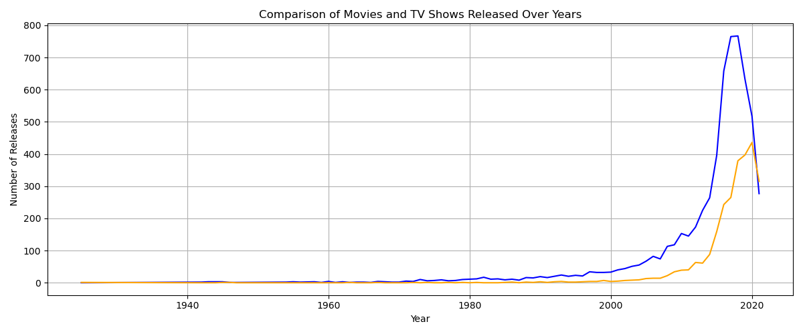

# 🎬 Netflix Data Analysis Project

<p align="center">
  
</p>

---

## 📌 Project Overview

This project focuses on exploring and analyzing the Netflix dataset to uncover valuable insights into movies and TV shows available on the platform. The objective is to understand content distribution, genre popularity, release trends, audience targeting, and global content production patterns.

Using Python-based data analysis and visualization techniques, this project transforms raw Netflix content data into meaningful business insights that help explain Netflix's content strategy and platform growth over time.

---

## 🚀 Key Features & Insights

### 🎥 Content Distribution Analysis
- Compare Movies and TV Shows available on Netflix.
- Understand the platform's content composition.
- Analyze content dominance across categories.

### 🎭 Genre Popularity Analysis
- Identify the most common genres on Netflix.
- Understand content production focus areas.
- Analyze viewer-oriented content trends.

### 📅 Release Trend Analysis
- Track content releases over multiple decades.
- Identify periods of rapid content expansion.
- Visualize Netflix's growth trajectory.

### 🌎 Country-Wise Content Analysis
- Explore the top countries contributing content.
- Analyze global content production trends.
- Understand Netflix's international content strategy.

### 👥 Audience Rating Analysis
- Analyze content ratings distribution.
- Understand audience targeting patterns.
- Evaluate maturity-level segmentation.

---

# 📊 Visualizations & Insights

## 1️⃣ Movies vs TV Shows Distribution

### Insight
Compares the total number of Movies and TV Shows available on Netflix to understand platform content preferences.

### 📷 Chart


---

## 2️⃣ Content Ratings Analysis

### Insight
Analyzes content ratings such as TV-MA, TV-14, PG-13, and other categories to understand audience targeting.

### 📷 Chart


---

## 3️⃣ Movie Duration Distribution

### Insight
Examines movie runtime patterns and identifies common duration ranges across Netflix movies.

### 📷 Chart


---

## 4️⃣ Release Year Analysis

### Insight
Visualizes content release trends over time and highlights Netflix's expansion in content acquisition and production.

### 📷 Chart


---

## 5️⃣ Top 10 Content-Producing Countries

### Insight
Identifies the countries contributing the most content to Netflix's global library.

### 📷 Chart


---

## 6️⃣ Movies vs TV Shows Comparison

### Insight
Provides a comparative trend analysis between Movies and TV Shows over time.

### 📷 Chart



---

## 💡 Key Insights & Conclusion

### 🔹 Movies Dominate the Platform
A significant portion of Netflix's content library consists of movies, although TV shows continue to grow rapidly.

### 🔹 Massive Growth After 2015
The data shows a substantial increase in content additions after 2015, reflecting Netflix's aggressive expansion strategy.

### 🔹 Mature Audience Focus
Content ratings indicate a strong focus on mature and teenage audiences through TV-MA and TV-14 categories.

### 🔹 Global Content Strategy
Netflix continues expanding internationally, with content contributions from a wide range of countries.

### 🔹 Diverse Content Portfolio
The platform maintains a balanced mix of genres, helping attract a broad global audience.

---

## 🛠️ Tech Stack

- Python
- Pandas
- NumPy
- Matplotlib
- Seaborn
- Jupyter Notebook

---

## 📂 Dataset

The dataset contains Netflix content metadata including:

- Title Information
- Content Type
- Genre
- Country
- Release Year
- Duration
- Cast & Director Information
- Content Ratings

---

## 📈 Skills Demonstrated

- Data Cleaning
- Exploratory Data Analysis (EDA)
- Data Visualization
- Statistical Analysis
- Feature Engineering
- Business Insight Generation
- Storytelling with Data
- Python Analytics

---

## 🎯 Business Value

✅ Understand Netflix content distribution strategy

✅ Analyze content growth trends over time

✅ Identify popular genres and audience segments

✅ Explore country-wise content contributions

✅ Evaluate rating-based audience targeting

✅ Support data-driven content strategy insights

---

## 🚀 How to Run This Project

### Clone Repository

```bash
git clone https://github.com/palaktonke06-a11y/Netflix-Data-analysis.git
```

### Install Dependencies

```bash
pip install pandas numpy matplotlib seaborn
```

### Run Jupyter Notebook

```bash
jupyter notebook
```

---

## 🔗 Project Link

### GitHub Repository

👉 https://github.com/palaktonke06-a11y/Netflix-Data-analysis

---

⭐ If you found this project useful, don't forget to star the repository.
